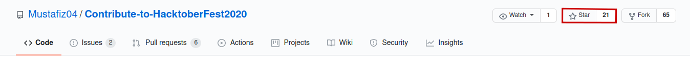
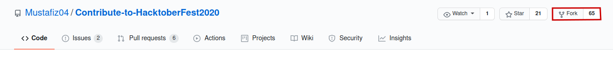
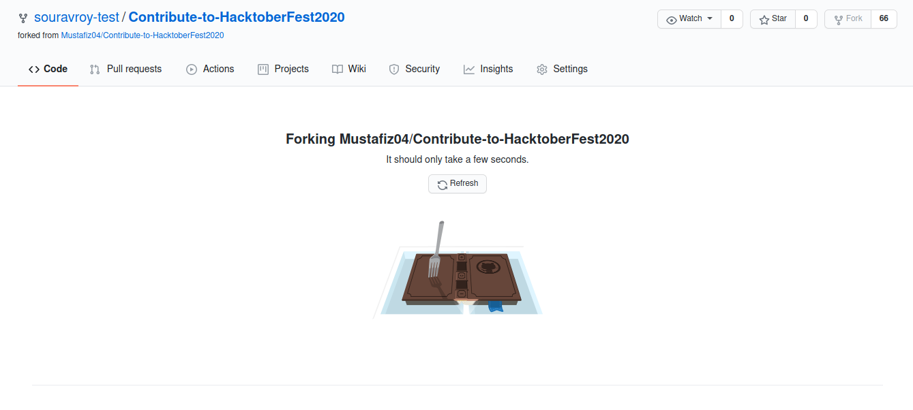
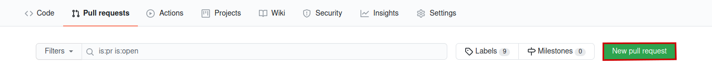
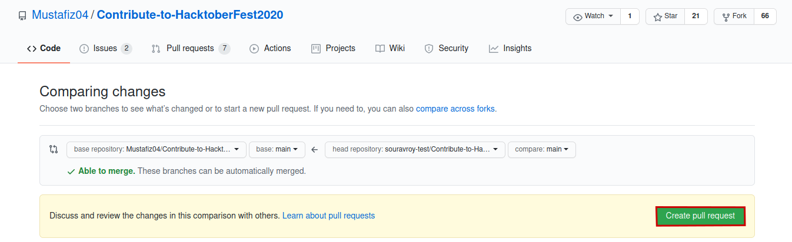
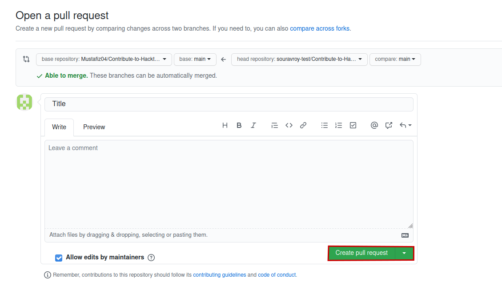

<h1 align="center"> Hacktoberfest-2021</h1>


<p align="center">
   
    
   
   
   
   
</p>

**Register [here](https://hacktoberfest.digitalocean.com) for Hacktoberfest-2021 and make 4 pull requests (PRs) between October 1-31 to earn a free T-shirt & Stickers.**

***

# Overview
The goal of this project is to help the beginners with their contributions in Open Source. We aim to achieve this collaboratively, so feel free to contribute in any way you want, just make sure to follow the contribution guidelines. You can contribute to it in either of the following ways:

- Beginners:
	- A "Hello World" program in your favorite language.
- Intermediate:
	- Add any one of your favorite algorithm in your favorite language, from simple to complex!
- Expert:
	- Add any graphical game in your favorite programming language!


# HacktoberFest-2021

Open source is changing the world - one pull request at a time. 


- [HacktoberFest-2021](#hacktoberfest-2021)
  - [What is Hacktoberfest?](#what-is-hacktoberfest)
  - [Why Should I Contribute?](#why-should-i-contribute)
  - [What Can I Contribute?](#what-can-i-contribute)
  - [How to Contribute in this repo.](#how-to-contribute-in-this-repo)

## What is Hacktoberfest?

Hacktoberfest is the easiest way to get into open source! Hacktoberfest is a month long festival of open source code presented by [Digital Ocean](https://www.digitalocean.com/), [Intel](https://hacktoberfest.digitalocean.com/intel.pdf) and [DEV](https://www.dev.to/) this year in 2021.

During the entire month of October 2021, all you have to do is contribute to any open source projects and open at least 4 pull requests. Yes, any project and any kind of contributions.

## Why Should I Contribute?

Hacktoberfest has a simple and plain moto.
> Support open source and earn a limited edition T-shirt and few stickers!

So, yes! You can win a T-Shirt and few awesome stickers to attach on your laptop. On plus side, you will get into beautiful world of open source and get the international exposure. 

But, it’s not just about the t-shirts or stickers. Its about supporting open source. Its about celebrating open source, and giving it back. If you’ve never contributed to open source before, this is the perfect time to get started because Hacktoberfest provides a large list of available contribution opportunities.

## What Can I Contribute?

Hacktoberfest&reg; is open to everyone in our global community. Whether you’re a developer, student learning to code. You can contribute to anything from code to simple fix, new feature to grammar mistake or documentation.

## How to Contribute in this repo.

Contributing to open-source is easy.

1. ### Star and Fork the Repo
		
   - Feel free to Star:star: the repo, if you like it.
     
    
   - Click on `fork` button in the right corner.It will create a copy of repository in your account.
     
   
   - Creating the copy of repository
     
   
    - Check here [How to fork](https://docs.github.com/en/github/getting-started-with-github/fork-a-repo)
    

2. ### Clone the Repo

   You can **clone** your repository in your local pc with use of **[Github_Desktop](https://desktop.github.com/)** application or for your [Terminal/bash](https://git-scm.com/downloads).

   For **Terminal** -

   ```bash
   git clone <url_name>
   ```

   - [Cloning the Repository](https://docs.github.com/en/github/creating-cloning-and-archiving-repositories/cloning-a-repository)
   
3. ### Create a new **branch**

   ```bash
   git checkout -b <branch_name>
   ```
   - [Creating a branch](https://git-scm.com/book/en/v2/Git-Branching-Basic-Branching-and-Merging)
    
4. ### Upload your Code or Change

    Make what change you want to make in Repo. It can be spelling mistake, code correction or anything.

    You can also upload your program to respective folder. It can be anything "Hello world program", "Rock Paper Scissors",etc.

    `All Repository are open for contributions.`

5. ### Push it and Make a PR

   - Go to the `Pull requests` section and Click the `New pull request` button.
     
    
    - Click the `Create pull request` to compare your copy of the repo with the real one.
    	
    
    - Write a `Title`, `Leave a comment` and click `Create New PR`button to merge the PR.
	
	And, that's it!
	
    New to Open Source? Don't know how to [`Create a Pull Request`](https://www.digitalocean.com/community/tutorials/how-to-create-a-pull-request-on-github)? read this documentation.


[Click here for detailed explanation](CONTRIBUTING.md)

_ _ _
## How to Update

In the case when you kept the original repository git history, so you have to update your repo from remote to avoid comflict and update to date your repo with others work. 
You can always pull and merge updates from the "upstream" repository back into your
project by running:

```bash
$ git fetch upstream            # Fetch (upstream) repository
$ git checkout main             # Switch to the main branch (or, master branch)
$ git merge upstream/main       # Merge upstream/master into the local branch
```
**Or**
```bash
$ git checkout main             # Switch to the main branch (or, master branch)
$ git pull origin main          # Fetch and Merge upstream/master into the local branch
```
_ _ _

## What if my pull requests aren’t accepted?

Even if your pull requests aren’t accepted, they should still count toward your 4 pull requests necessary to earn the shirt. The only exception would be if the project maintainer chooses to mark your pull request as “invalid”. They may do this if they perceive your pull request to be low effort, or if it contains plagiarism.

## What kinds of pull requests count toward earning the Hacktoberfest shirt?
Any pull request made to a public repo on GitHub will count. The pull request must contain commits you personally made yourself — not automated commits from bots.

You can contribute to any open source project hosted on Github.com and contribute anything between October 1 to October 31 midnight in 2021. You will find plenty of issues labeled with hacktoberfest or good-first-issue etc on Github. These will be the simple ones most probably and easy to fix.

Check out [Official Hacktoberfest 2021 page](https://hacktoberfest.digitalocean.com/) for more info.

### Made with ♥ by <a href="https://github.com/Mustafiz04">Mustafiz04</a>

[](https://github.com/Mustafiz04)


---
## References

- [Hacktoberfest presented by DigitalOcean](https://hacktoberfest.digitalocean.com/)
- [A participation guide for Hacktoberfest](https://dev.to/zenika/a-participation-guide-for-hacktoberfest-19c1)
- [What is Hacktoberfest and How can a beginner contribute?](https://medium.com/@bawantharathnayaka/what-is-hacktoberfest-and-how-can-a-beginner-contribute-39cf2081804e)
- [Hacktoberfest 2019: How you can get your free shirt — even if you’re new to coding](https://www.freecodecamp.org/news/hacktoberfest-2018-how-you-can-get-your-free-shirt-even-if-youre-new-to-coding-96080dd0b01b/)
